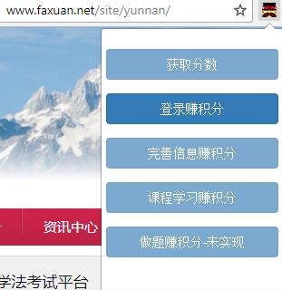
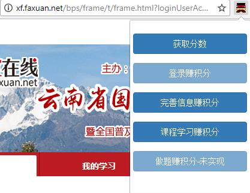

# faxuan [![NPM version][npm-image]][npm-url] [![Build Status][travis-image]][travis-url] [![NSP Status][nsp-image]][nsp-url] [![Maintainability][codeclimate-maintainability-image]][codeclimate-maintainability-url] [![Test Coverage][codeclimate-test_coverage-image]][codeclimate-test_coverage-url] [![HitCount][hits-image]][hits-url] [![dependencies Status][daviddm-image]][daviddm-url] [![devDependencies Status][daviddm-dev-image]][daviddm-dev-url] [![Code Health][landscape-image]][landscape-url] [![Waffle.io - Columns and their card count][waffle-image]][waffle-url] [](https://github.com/dwyl/goodparts "JavaScript The Good Parts")
> Useful tool to get score of faxuan platform.

## Development

We assume you have pre-installed [node.js](https://nodejs.org/) and git.

```bash
git clone https://github.com/liudonghua123/faxuan.git
cd faxuan
```

Install dependencies

```bash
npm install
```

Build the extension

```bash
gulp babel
```


Package the extension

```bash
gulp build
```

Build the extension for development

```bash
gulp watch
```

## How to install the build extension

For unpacked extension in development

1. Open Chrome [extension page](chrome://extensions/)
2. Enable developer mode
3. Load unpacked extension and select the app directory

For packaged extension

1. Open Chrome [extension page](chrome://extensions/)
2.  Pack extension and select the crx file

## How to use

1. Visit [http://www.faxuan.net/site/yunnan/](http://www.faxuan.net/site/yunnan/) and Login
2. On [http://www.faxuan.net/site/yunnan/](http://www.faxuan.net/site/yunnan/) page, click the faxuan icon and click 'Earn login score'
3. On the new popuped tab [http://xf.faxuan.net](http://xf.faxuan.net), click the faxuan icon and click 'Earn complete score' and so on.






## Getting To Know Chrome extension

 * [Getting Started: Building a Chrome Extension](https://developer.chrome.com/extensions/getstarted)
 * [generator-chrome-extension](https://github.com/yeoman/generator-chrome-extension)

## License

MIT © [liudonghua](http://www.liudonghua.com)


[npm-image]: https://badge.fury.io/js/faxuan.svg
[npm-url]: https://npmjs.org/package/faxuan
[nsp-image]: https://nodesecurity.io/orgs/liudonghua123/projects/fcdee9d7-dbb0-4746-909b-92b003494e86/badge
[nsp-url]: https://nodesecurity.io/orgs/liudonghua123/projects/fcdee9d7-dbb0-4746-909b-92b003494e86
[codeclimate-maintainability-image]: https://api.codeclimate.com/v1/badges/3fa157a4472632c3c088/maintainability
[codeclimate-maintainability-url]: https://codeclimate.com/github/liudonghua123/faxuan/maintainability
[codeclimate-test_coverage-image]:  https://api.codeclimate.com/v1/badges/3fa157a4472632c3c088/test_coverage
[codeclimate-test_coverage-url]: https://codeclimate.com/github/liudonghua123/faxuan/test_coverage
[hits-image]: http://hits.dwyl.io/liudonghua123/faxuan.svg
[hits-url]: http://hits.dwyl.io/liudonghua123/faxuan
[travis-image]: https://travis-ci.org/liudonghua123/faxuan.svg?branch=master
[travis-url]: https://travis-ci.org/liudonghua123/faxuan
[daviddm-image]: https://david-dm.org/liudonghua123/faxuan/status.svg
[daviddm-url]: https://david-dm.org/liudonghua123/faxuan
[daviddm-dev-image]: https://david-dm.org/liudonghua123/faxuan/dev-status.svg
[daviddm-dev-url]: https://david-dm.org/liudonghua123/faxuan?type=dev
[landscape-image]: https://landscape.io/github/liudonghua123/faxuan/master/landscape.svg?style=flat
[landscape-url]: https://landscape.io/github/liudonghua123/faxuan/master
[waffle-image]: https://badge.waffle.io/liudonghua123/faxuan.svg?columns=all
[waffle-url]: http://waffle.io/liudonghua123/faxuan
